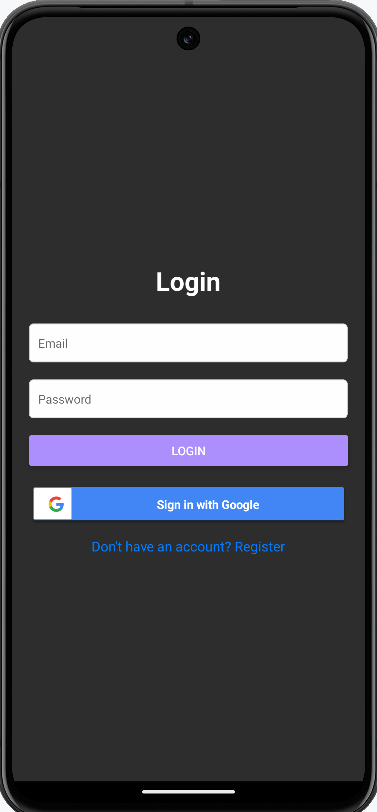
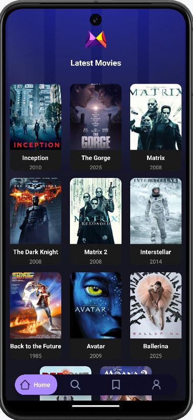
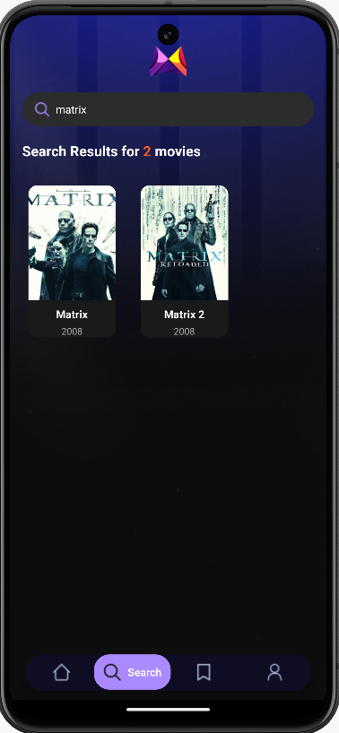
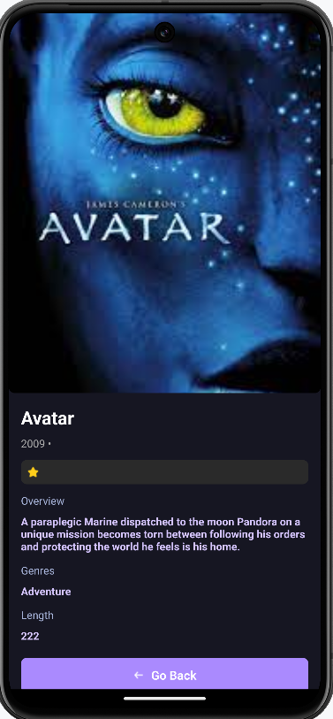

# Movie Mobile App

## Overview
Movie Mobile App is a React Native application that allows users to browse a list of movies, view detailed movie information, and manage their profiles. The app supports authentication with an external provider and includes push notification functionality.

## Features
- **Authentication**
  - Users can log in using an external provider (Google, Facebook, or Apple).
  - Users can log in using Nest.js
  
- **Movies List Screen**
  - Displays a list of movies.
  - Clicking a movie navigates to the Movie Details Screen.

- **Movie Details Screen**
  - Displays detailed information about a selected movie (title, year, genre, cover photo, description, added on).

- **Profile Screen**
  - Shows user profile details (username, email).
  - Includes a logout button.

- **Navigation**
  - Bottom tab navigation between Movies List and Profile Screens.

- **Push Notifications**
  - Users receive push notifications.
  - Opening a notification navigates the user to a specific Movie Details Screen.

## Features
- UI designed with an intuitive and visually appealing layout.

## Technology Stack
### Frontend (Mobile App)
- React Native
- Expo Router
- Firebase Authentication (Google Sign-In)
- Firebase Firestore
- Context API 
- React Navigation (Bottom Tabs & Stack Navigator)
- Expo Push Notifications

### Backend
- Nest.js

## Setup Instructions
### Prerequisites
- Node.js installed (Recommended version: v22.9.0)
- Expo CLI installed (`yarn global add expo-cli`)
- Firebase account setup
- Run Nest.js server

### Installation Steps
1. **Clone the repository**
   ```sh
   git clone <repository_url>
   cd movie-mobile-app
   ```

2. **Install dependencies**
   ```sh
   npm install
   ```

3. **Configure Firebase**
   - Create a Firebase project and enable Authentication (Google Sign-In).
   - Add Firestore database and configure rules.
   - Update `firebaseConfig.js` with Firebase credentials.

4. **Run backend server**
  mobile_movie_app_backend project

5. **Run the React Native app**
   ```sh
   npx expo run:android
   ```

### Running on a Device/Simulator
- For Android: Use an emulator (Android Studio) or a physical device.
- For iOS: Use an iPhone simulator (Xcode) or a real device.

## Push Notifications Setup
1. Enable push notifications in Firebase Cloud Messaging (FCM).
2. Configure `expo-notifications` in `App.js`.
3. To send a push notification, use the Firebase console.

## Demo Credentials
- Test Login Credentials (Facebook/Google):
  - Email: `testuser@example.com`
  - Password: `password123`

## Future Enhancements
- Implement real-time data fetching.
- Store user-generated content in Firebase Firestore.
- Enhance UI with animations and themes.

## License
This project is for demonstration purposes only.

---
For any questions or issues, feel free to contact the repository owner.


## Screenshot




